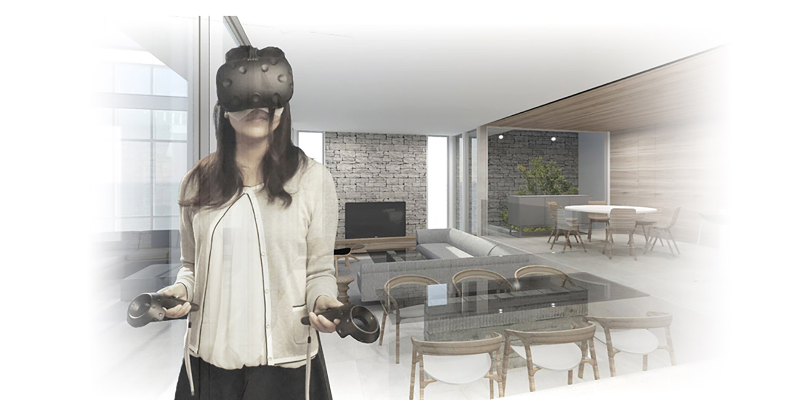

_People who are in search for homes hate wasting time, whether buying a residential house or investing in real estate property. The thought of the hours spend on driving, visiting and standing in open houses could instantly turn one off. For a realtor, the hours put into the preparation of an open house, taking photos and editing them and finally taking clients to get their attention could be overwhelming. Fortunately, the advanced in technology has paved the way of a system that could boost efficiency of real estate purchasing and has the potential to revolutionize the real estate industry. This particular technology is known as Virtual Reality.._.

Many people have heard about all the wonderful, futuristic things that virtual reality could do. For a real estate company or investor, now is the time to leverage VR to lead the market. The most obvious benefit of virtual reality in the field of real estate is that a client is able to see a prospective home as if he or she is actually there. This new way is a fresh and convincing way of marketing a property, but also makes it so much easier to view it. Simpler access to view a home or property lead to more views and obviously the best way of selling real estate is exposure.

Using virtual reality to market a property has the potential to increase investor interest. VR marketing particularly works for high-end homes. This makes sense when considering the large financial commitment that investors make, often from their executive office in another city or even in another country. Despite how realistic the VC content appears, the chance to simply just be present in the place, albeit virtually, could instantly provide an accurate understanding of the space.

Using virtual reality to market a property has the potential to increase investor interest. VR marketing particularly works for high-end homes. This makes sense when considering the large financial commitment that investors make, often from their executive office in another city or even in another country. Despite how realistic the VC content appears, the chance to simply just be present in the place, albeit virtually, could instantly provide an accurate understanding of the space.

Probably the biggest benefit of virtual reality tours in the field of real estate is that it saves money and time. After virtual reality viewing, clients could narrow down their choices, and thus, there will be a decrease in unproductive visits and a boost in serious visit requests. Instead of taking and managing thousands and thousands of individual photos, real estate agents and engineers now could simply manage one file and showcase the real space. Moreover, rather than preparing for an open house that will last for only a day, companies could now make the place accessible 24/7 and prospective buyers could view or experience the place at their own convenience. This is particularly true for international or high-profile buyers.

The process of scheduling and visiting could be taxing. To check out just one region, for instance HARGEISA., could take two whole days to visit ten houses due to traffic. The money and time saving benefit of virtual reality is obvious. There is an actual case wherein an international buyer saw and bought the listing without visiting it physically. The sales process saves a lot of time and human resources for both parties. With VR, there is no need to fly for international buyers or take time off work.

With virtual reality, a person may be sitting in an office or home, but with a headset strapped to his face, he could be walking through a condominium. That is the appeal of VR, which people nowadays believe is the next cutting edge technology in the industry, allowing homeowners in other cities or even countries to tour properties they might want to purchase in another city or country remotely, without stepping out of their comfort one. Moreover, local buyers could skip the issue of open houses. One could be in Chicago or Paris, put on a pair of virtual reality headset and walk through a property in India. VR real estate solutions make a buyer feel as if actually on the place, walking around it, opening gates, checking out windows and seeing how the feel and look of a home changes from dawn to dusk.

People usually are confused between 3D virtual tour and Interactive app with VR support. However, it really is simple, 3D virtual tour is the same as moving through a home, but you’re aware that you’re looking at a screen. In the case of interactive app with VR support, as soon as you put on a headset, it is similar to being in that condo place. Virtual reality is a rapid growing technology and proves to be extremely helpful for busy clients who might find it hard to visit a property personally due to their busy schedules. They could see it easily on their computers.

These days, several builders and realtors are using virtual reality to cope with the competitive market at present. People who actually use the solutions proclaim that it is not at all strange for properties to be sold within hours of listing. FurthermoreFree Articles, it is also not unusual for buyers to make an offer during a walkthrough.
